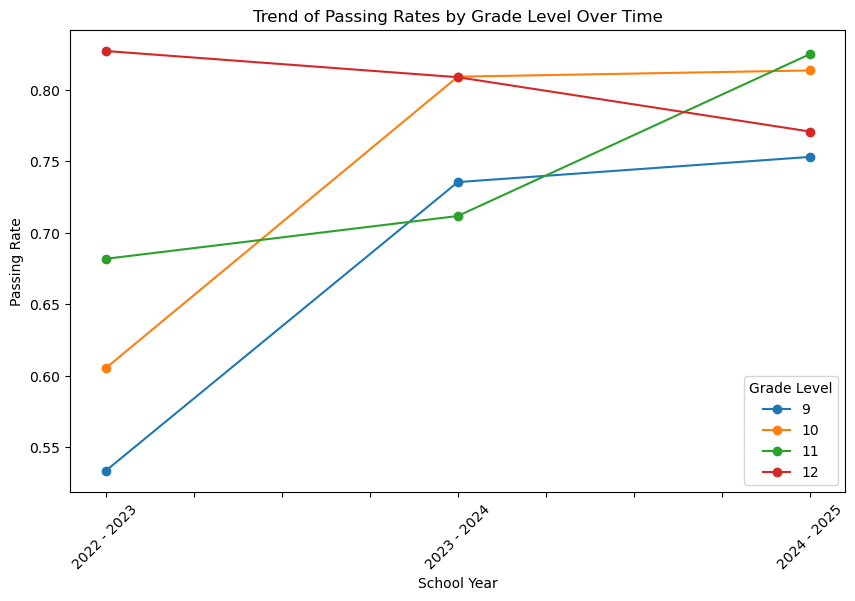

# 📊 Virtual Academy Grades Analysis

This repository contains a data analysis notebook focused on student grade data from a Virtual Academy program. The project cleans and explores semester grades across multiple school years and grade levels, providing insights into academic trends and performance.

## 📁 File Overview

- **`Virtual-Academy-Grades-Clean.ipynb`**  
  The main analysis notebook. It includes:
  - Cleaning and preprocessing of raw grade data.
  - Categorization of grades as "Passing" or "Not Passing."
  - Year-over-year visualizations of student performance.
  - Disaggregation by grade level and semester.

## 🧼 Data Cleaning Highlights

- Grades are standardized across two semesters.
- Letter grades are mapped into:
  - **Passing**: A, B, C, D, P  
  - **Not Passing**: F, I, NP, NG, WF, *
- School years and grade levels are normalized for analysis.

## Pass/Fail Mapping

| Letter | Pass (1/0) | Notes |
|---|---|---|
| A | 1 | |
| B | 1 | |
| C | 1 | |
| D | 1 (configurable) | Consider sensitivity: treat D as 0 and observe impact |
| P | 1 | Pass |
| F | 0 | Fail |
| I | 0 or exclude | Incomplete — document your policy |
| NP | 0 | No Pass |
| NG | 0 | No Grade |
| WF | 0 | Withdraw Fail |
| * | exclude | Any non-standard marks — document before analysis |

## How to Run

```bash
pip install -r requirements.txt
jupyter notebook "Virtual-Academy-Grades-Clean.ipynb"
```
> Note: Raw source data is not included. If you have a similarly-shaped CSV, update the file path in the notebook and rerun the cells.

## Cohorts & Semesters

- **Cohort (expected grad year):** Example — `cohort = entry_year + 4` (adjust to your district policy).  
- **Semester mapping:** Example — `S1: Aug–Dec`, `S2: Jan–May`. Explicitly list your date ranges to ensure reproducibility.

## Figures (quick-glance)




## 📈 Key Visualizations

- Overall distribution of passing vs. not passing grades by school year.
- Semester-specific trends for each student cohort (based on expected graduation year).
- Bar charts comparing performance across semesters and grade levels.

## 🛠️ Tech Stack

- **Python** (Pandas, Matplotlib, Seaborn)
- **Jupyter Notebook**

## 🎯 Goals

- Understand performance trends over time in the Virtual Academy.
- Identify student cohorts or grade levels that may need additional support.
- Share findings with educators and school leadership to inform decision-making.

## 📌 Notes

- Student data has been anonymized.
- The analysis is focused on patterns and trends, not individual performance.
- **Raw student data is not included in this repository due to privacy and confidentiality concerns.**

## ✅ Future Work

- Integrate attendance and testing data for deeper insights.
- Analyze longitudinal growth or decline per student cohort.
- Build predictive models to flag at-risk students.
